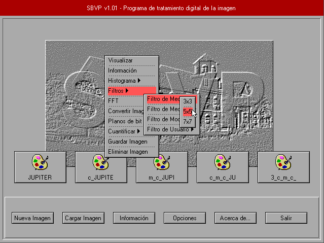

# SBVP
My Degree Final Project, presented in 1997: An Image Processing Program for MS-DOS.

You can [try it online](https://dcrespo3d.github.io/SBVP/index.html), thanks to the online MS-DOS emulator [JS-DOS](https://js-dos.com/).

Project features:
- Runs on MS-Dos 6 or 7 (Windows 95).
- Loads and saves BMP images (8-bit palette, 24 bit RGB).
- Displays images using VBE (Vesa BIOS extensions) graphic modes up to 1280x1024x32.
- Can convert between image formats (RGB -> Grayscale -> Dithered mono).
- Bit plane extraction, quantization to less than 8 bits.
- Image filtering algorithms: mean, median, custom kernel.
- 2D FFT (Fast Fourier Transform) of image contents.
- Histogram view.
- Developed on Borland C 3.1 for MS-Dos.
- Uses XMS (eXtended memory specification) for getting over the MS-Dos 640 Kb memory limit.
- Uses custom GUI at 640x480x4, with custom buttons, dialogs, etc; running on Borland BGI graphics interface.

This was my first software project and it's poorly organized and implemented. I have learned a lot since those days. But I was proud of the result back in the day, it was my first big project and I learned a lot about software development (specially, things NOT to do :)

